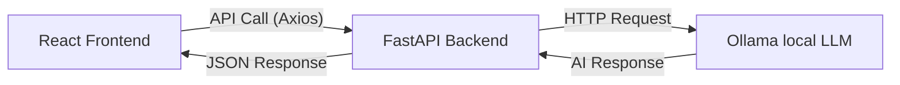

# 🤖 AI Chatbot Project Guide

This guide provides everything you need to know about running, understanding, and explaining the **Local AI Chatbot**.

---

## 🚀 1. How to Run the Project

To run this project, you need three main components active at the same time:

### A. Ollama (The Brain)
Ollama runs the actual AI model locally on your machine.
1. Make sure **Ollama** is installed and running in your system tray.
2. Open a terminal and run:
   ```bash
   ollama pull tinyllama
   ```
   *(Note: You can use `llama3` for better results if your PC has enough RAM).*

### B. Backend (The Bridge)
The FastAPI backend connects the frontend to the AI model.
1. Open a new terminal in the `backend` folder.
2. (Optional) Activate your virtual environment: `venv\Scripts\activate`
3. Run the server:
   ```bash
   python main.py
   ```
   *Live at: http://localhost:8000*

### C. Frontend (The Interface)
The React application provides the user interface.
1. Open a new terminal in the `frontend` folder.
2. Install dependencies (first time only): `npm install`
3. Start the UI:
   ```bash
   npm run dev
   ```
   *Live at: http://localhost:5173*

---

## 🏗️ 2. How the Project Works (Technical Architecture)

The project follows a modern **three-tier architecture**:



1.  **Frontend (React + Vite + Tailwind CSS)**:
    *   Captures user input.
    *   Manages chat state (message history).
    *   Renders messages with markdown support for a clean look.
2.  **Backend (FastAPI)**:
    *   Acts as a secure intermediary.
    *   Receives requests from the frontend and communicates with the Ollama server.
    *   Includes health checks to monitor system status.
3.  **Local AI (Ollama)**:
    *   Loads and runs the Large Language Model (LLM) like `tinyllama` or `llama3`.
    *   Generates the actual intelligence without needing an internet connection.

---

## 👔 3. How to Explain it to HR

When explaining this project to an HR representative or during an interview, focus on the **Value**, **Technologies**, and **Problem Solving**:

### The "Elevator Pitch"
> "I built a **Local AI Chatbot** that allows for secure, offline AI interactions. It's a full-stack application using a modern tech stack: **React** for a responsive user interface, **FastAPI** for a high-performance backend, and **Ollama** to run Large Language Models locally. I designed it to be production-ready with features like real-time communication, error handling, and a clean, user-centric design."

### Key Talking Points for HR:
*   **Privacy & Security**: "Because the AI runs locally on the machine, sensitive data never leaves the server, making it ideal for privacy-conscious organizations."
*   **Full-Stack Proficiency**: "This project demonstrates my ability to bridge the gap between frontend UI (React) and backend logic (Python/FastAPI) while integrating cutting-edge AI technologies."
*   **Resource Efficiency**: "I optimized it to run even on modest hardware by using efficient models like `tinyllama`, showing my focus on performance."
*   **Clean Architecture**: "The codebase follows best practices with a clear separation of concerns, making it scalable and easy to maintain."

---

*Last Updated: February 6, 2026*
